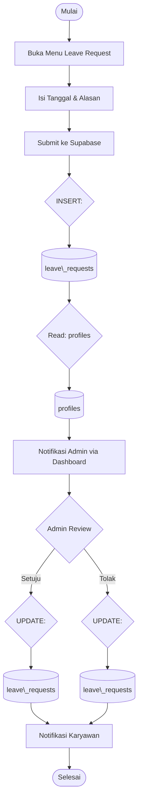
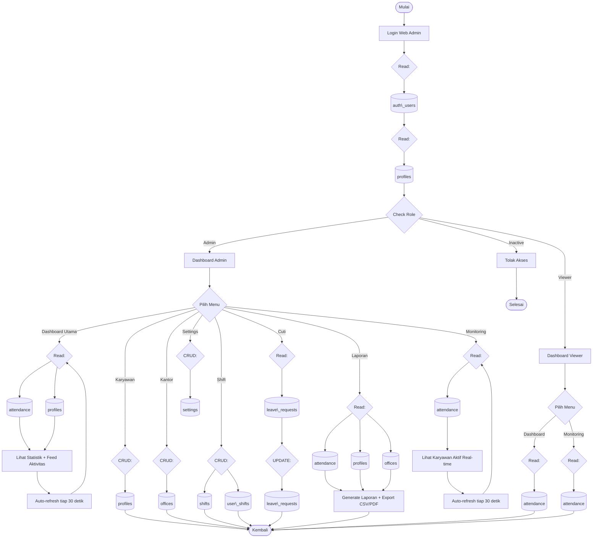
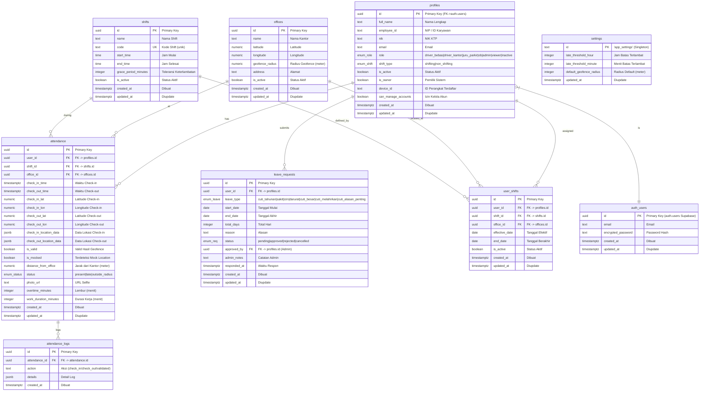
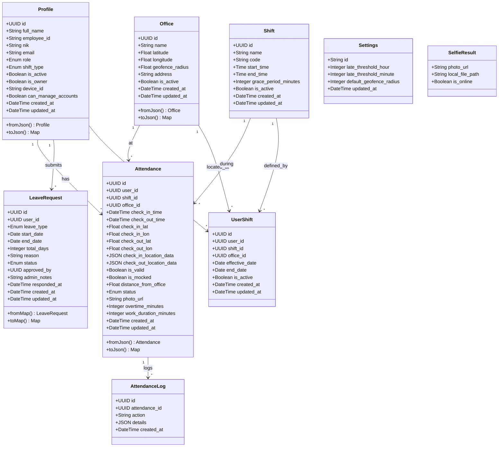
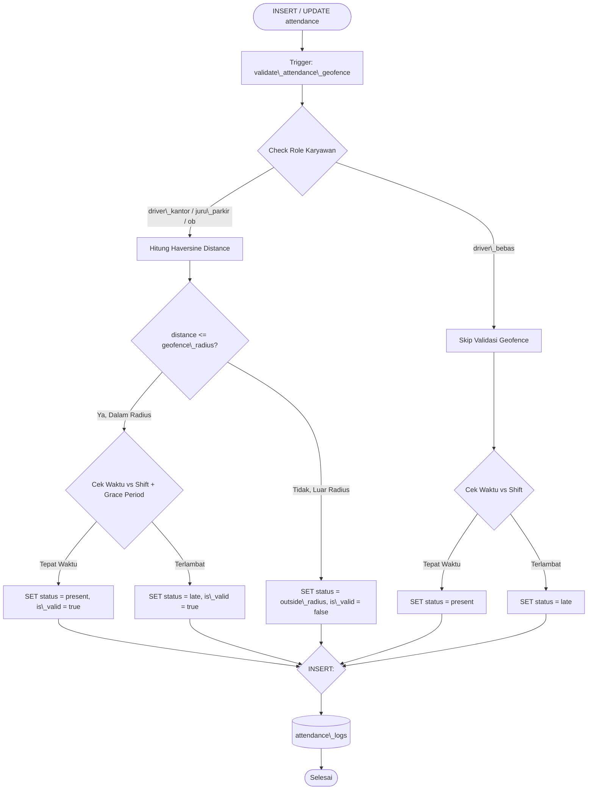

# Activity Diagram & Database ERD — GeoAttend Pro

## 1. Activity Diagram — Alur Absensi Karyawan (dengan Database)

```mermaid
flowchart TD
    Start([Mulai]) --> BukaApp[Buka Aplikasi]
    BukaApp --> PilihShift{Pilih Shift}
    PilihShift -->|Shifting| ShiftScreen[Pilih: Pagi / Sore]
    PilihShift -->|Non-Shifting| Langsung
    ShiftScreen --> Login
    Langsung[Lanjut ke Login] --> Login

    Login{Login Method}
    Login -->|Email & Password| AuthEmail[Auth via Supabase]
    Login -->|Biometric| AuthBio[Auth via Fingerprint/FaceID]
    AuthEmail --> ReadAuthDB{Read:}
    AuthBio --> ReadAuthDB
    ReadAuthDB --> ReadAuthUsers[(auth\_users)]
    ReadAuthUsers --> LoadProfile

    LoadProfile[Load Profile] --> ReadProfiles{Read:}
    ReadProfiles --> ReadProfileDB[(profiles)]

    ReadProfileDB --> CekAktif{Akun Aktif?}
    CekAktif -->|Tidak| Blokir[Tampilkan Pesan Blokir]
    CekAktif -->|Ya| Dashboard

    Dashboard[Dashboard Load] --> GpsStart[Start GPS Tracking]
    GpsStart --> ReadOffices{Read:}
    ReadOffices --> ReadOfficeDB[(offices)]
    ReadOfficeDB --> ReadUserShifts{Read:}
    ReadUserShifts --> ReadUserShiftDB[(user\_shifts)]
    ReadUserShiftDB --> ReadShifts{Read:}
    ReadShifts --> ReadShiftDB[(shifts)]

    ReadShiftDB --> RenderMap[Render Map: User + Office + Geofence Circle]
    RenderMap --> HitungJarak[Hitung Jarak Haversine]
    HitungJarak --> CekGeofence{ Jarak <= Radius Geofence? }

    CekGeofence -->|Ya| EnableBtn[Enable Tombol Check-In]
    CekGeofence -->|Tidak| DisableBtn[Disable Tombol + Tampilkan Jarak]

    EnableBtn --> TapCheckIn{Tap Check-In?}
    TapCheckIn -->|Ya| BukaKamera[Buka Kamera Depan Auto-Capture]
    TapCheckIn -->|Tidak| EnableBtn
    BukaKamera --> Kompres[Kompres Gambar <50KB]
    Kompres --> UploadSelfie{Upload:}
    UploadSelfie --> UploadStorage[Storage Bucket: selfie\_absensi]

    UploadStorage --> InsertCheckIn{INSERT:}
    InsertCheckIn --> WriteAttendance[(attendance)]

    WriteAttendance --> TriggerGeofence[Trigger: validate\_attendance\_geofence]
    TriggerGeofence --> HitungServer[Hitung Jarak Server-side Haversine]
    HitungServer --> SetStatus{Tentukan Status}
    SetStatus -->|Tepat Waktu & Dalam Radius| Present[Status: present]
    SetStatus -->|Terlambat & Dalam Radius| Late[Status: late]
    SetStatus -->|Luar Radius| Outside[Status: outside\_radius]

    Present --> WriteLogA{INSERT:}
    Late --> WriteLogA
    Outside --> WriteLogA
    WriteLogA --> WriteLogDB[(attendance\_logs)]

    WriteLogDB --> Aktifitas[Masa Kerja]

    Aktifitas --> TapCheckOut{Tap Check-Out?}
    TapCheckOut -->|Ya| InsertCheckOut{UPDATE:}
    TapCheckOut -->|Tidak| Aktifitas
    InsertCheckOut --> UpdateAttendance[(attendance)]

    UpdateAttendance --> TriggerOvertime[Trigger: Hitung Overtime & Durasi]
    TriggerOvertime --> WriteLogB{INSERT:}
    WriteLogB --> WriteLogDB2[(attendance\_logs)]
    WriteLogDB2 --> End([Selesai])

    DisableBtn --> CekGeofence
    Blokir --> End
```

## 2. Activity Diagram — Alur Cuti/Izin (dengan Database)

## 3. Activity Diagram — Alur Admin Dashboard (dengan Database)

## 4. Database ERD

## 5. Class Diagram — Domain Models & Database Entities

## 6. Class Diagram — Flutter App (Services & Screens)

```mermaid
classDiagram
    class AuthService {
        -SupabaseClient _supabase
        -User _user
        -Map _profile
        -bool _isLoading
        +get user
        +get profile
        +get isLoading
        +signUp() String?
        +signIn() String?
        +resetPassword() String?
        +updateProfile() String?
        +changePassword() String?
        +signOut() void
        +refreshProfile() void
    }

    class LocationService {
        -bool _isTracking
        -double _currentDistance
        -bool _isInRadius
        -bool _isMocked
        -bool _permissionDenied
        -bg.Location _currentLocation
        +calculateDistance() double
        +updateDistance() void
        +startTracking() void
        +stopTracking() void
        +requestPermission() bool
        +_detectMockLocation() bool
    }

    class OfficeService {
        -SupabaseClient _supabase
        -double _latitude
        -double _longitude
        -double _radius
        -String _name
        -bool _isLoading
        +get isReady
        +fetchOffice() void
    }

    class SyncService {
        -SupabaseClient _supabase
        -DatabaseHelper _db
        -StreamSubscription _connectivitySubscription
        -Timer _syncTimer
        -bool _isOnline
        -bool _isSyncing
        -int _pendingCount
        +saveAttendanceOffline() bool
        +updateAttendanceOffline() bool
        +forceSync() bool
        +toggleAutoSync() void
        +get formattedLastSync
        +getTodayAttendance() List
    }

    class LeaveService {
        -SupabaseClient _supabase
        -List~LeaveRequest~ _leaveList
        -bool _isLoading
        +fetchLeaveRequests() void
        +submitLeaveRequest() bool
        +cancelLeaveRequest() bool
        +approveLeave() bool
        +rejectLeave() bool
        +get pendingCount
        +get approvedCount
    }

    class AdminService {
        -SupabaseClient _supabase
        -List~Map~ pendingUsers
        -List~Map~ activeUsers
        -bool _isLoading
        +fetchAllUsers() void
        +toggleUserActive() bool
        +approveUser() bool
        +deactivateUser() bool
        +get pendingCount
        +get activeCount
    }

    class BiometricService {
        +isBiometricAvailable() bool
        +hasEnrolledBiometrics() bool
        +authenticate() bool
        +saveCredentials() void
        +clearCredentials() void
        +getSavedCredentials() Map
    }

    class ShiftScheduleService {
        +getTodayShift() String?
        +hasSelectedShiftToday() bool
        +selectShift() bool
        +getShiftForDate() String?
        +getShiftHistory() List
    }

    class SelfieService {
        +getFrontCamera() CameraDescription
        +compressImage() String
        +uploadPhoto() String
        +captureAndUpload() SelfieResult
        +uploadLocalPhoto() String
    }

    class NotificationService {
        +initialize() bool
        +requestPermissions() bool
        +showCheckInSuccess() void
        +showCheckOutSuccess() void
        +showAttendanceSavedOffline() void
        +showLateNotification() void
        +showMockLocationAlert() void
        +scheduleCheckInReminder() void
        +scheduleCheckOutReminder() void
    }

    class ReportService {
        +generateAttendancePdf() void$
    }

    class DatabaseHelper {
        -static DatabaseHelper instance$
        -static Database _database$
        +get database
        +insertPendingAttendance() int
        +getPendingAttendances() List
        +updatePendingAttendance() int
        +getPendingCount() int
        +insertSyncLog() int
        +setState() void
        +getState() String?
        +clearAllData() void
    }

    class DashboardScreen {
        -MapController _mapController
        -double _officeLat
        -double _officeLon
        -double _radius
        -bool _isProcessing
        -Map _todayAttendance
        -String _todayShift
        -Timer _distanceUpdateTimer
        +_loadOffice() void
        +_loadUserData() void
        +_handleAttendance() void
        +_fetchTodayAttendance() void
    }

    class LoginScreen {
        +_handleLogin() void
        +_handleBiometric() void
    }

    class LeaveRequestScreen {
        +_submitLeave() void
    }

    class AdminScreen {
        +_approveUser() void
        +_deactivateUser() void
    }

    class SelfieCameraOverlay {
        -CameraController _controller
        -bool _isProcessing
        -int _countdown
        -AnimationController _animController
        +_initCamera() void
        +_startCountdown() void
        +_captureAndProcess() void
    }

    class AuthWrapper {
        +build() Widget
    }

    AuthService <|-- ChangeNotifier : extends
    LocationService <|-- ChangeNotifier : extends
    OfficeService <|-- ChangeNotifier : extends
    SyncService <|-- ChangeNotifier : extends
    LeaveService <|-- ChangeNotifier : extends
    AdminService <|-- ChangeNotifier : extends

    SyncService --> DatabaseHelper : uses
    SyncService --> SelfieService : uses
    SyncService --> NotificationService : uses
    LeaveService --> NotificationService : uses

    DashboardScreen --> AuthService : uses
    DashboardScreen --> LocationService : uses
    DashboardScreen --> OfficeService : uses
    DashboardScreen --> SyncService : uses
    DashboardScreen --> ShiftScheduleService : uses
    DashboardScreen --> SelfieService : uses
    DashboardScreen --> NotificationService : uses

    LoginScreen --> AuthService : uses
    LoginScreen --> BiometricService : uses

    LeaveRequestScreen --> LeaveService : uses

    AdminScreen --> AdminService : uses
    AdminScreen --> AuthService : uses

    AuthWrapper --> DashboardScreen : routes to
    AuthWrapper --> AdminScreen : routes to
    AuthWrapper --> LoginScreen : routes to
    LoginScreen --> RegistrationScreen : navigates to
    DashboardScreen --> HistoryScreen : navigates to
    DashboardScreen --> StatisticsScreen : navigates to
    DashboardScreen --> ProfileScreen : navigates to
    DashboardScreen --> LeaveRequestScreen : navigates to
```

## 7. Class Diagram — Next.js Web App (Hooks, Components & Pages)

```mermaid
classDiagram
    class AuthProvider {
        +User user
        +Profile profile
        +Boolean loading
        +signIn() Promise
        +signUp() Promise
        +signOut() Promise
        +refreshProfile() Promise
    }

    class useAuth {
        <<hook>>
        +user
        +profile
        +loading
        +signIn()
        +signUp()
        +signOut()
        +refreshProfile()
    }

    class useAttendance {
        <<hook>>
        +Attendance todayAttendance
        +List~Attendance~ history
        +Boolean loading
        +String error
        +clockIn() Promise
        +clockOut() Promise
        +fetchTodayAttendance() Promise
        +fetchHistory() Promise
    }

    class useAttendanceRate {
        <<hook>>
        +List~EmployeeStat~ stats
        +Boolean loading
        +Period period
        +Float avgRate
        +EmployeeStat mostLate
        +EmployeeStat bestAttendee
        +Int totalAbsent
    }

    class useDashboardAnalytics {
        <<hook>>
        +DashboardAnalytics data
        +Boolean loading
        +Period period
        +refresh() Promise
    }

    class useEmployees {
        <<hook>>
        +List~Profile~ employees
        +Boolean loading
        +fetchEmployees() Promise
        +updateEmployee() Promise
        +toggleRole() Promise
        +createEmployee() Promise
        +deactivateEmployee() Promise
    }

    class useReports {
        <<hook>>
        +List~AttendanceWithProfile~ records
        +Boolean loading
        +fetchReport() Promise
        +fetchDashboardData() Promise
        +getStats() Object
        +getEmployeeSummary() Object
        +deleteByDate() Promise
    }

    class useOffices {
        <<hook>>
        +List~Office~ offices
        +Office currentOffice
        +Boolean loading
        +fetchOffices() Promise
        +createOffice() Promise
        +updateOffice() Promise
        +deleteOffice() Promise
    }

    class useLeaveRequests {
        <<hook>>
        +List~LeaveRequest~ requests
        +Boolean loading
        +fetchRequests() Promise
        +approveLeave() Promise
        +rejectLeave() Promise
        +createLeave() Promise
        +cancelLeave() Promise
    }

    class useActivityLogs {
        <<hook>>
        +List~AttendanceLog~ logs
        +Boolean loading
        +fetchLogs() Promise
    }

    class useAdminSettings {
        <<hook>>
        +AdminSettings settings
        +Boolean synced
        +Boolean loading
        +List~ShiftConfig~ shifts
        +syncFromDB() Promise
        +updateSettings() Promise
        +resetSettings() Promise
        +fetchShifts() Promise
        +updateShift() Promise
    }

    class Button {
        +String variant
        +String size
        +Boolean loading
        +onClick() void
    }

    class StatsCard {
        +Icon icon
        +String value
        +String label
        +Float trend
        +String color
    }

    class Badge {
        +String variant
        +String text
    }

    class Modal {
        +Boolean isOpen
        +Function onClose
        +String title
        +String size
    }

    class Table {
        +List~Column~ columns
        +List~Object~ data
        +Boolean loading
        +String sortKey
        +String sortDir
        +onSort() void
        +onRowClick() void
    }

    class Sidebar {
        +Boolean open
        +onClose() void
    }

    class AdminLayout {
        +children ReactNode
    }

    class AdminDashboard {
        +useAttendance()
        +useOffices()
        +useEmployees()
        +useReports()
        +useDashboardAnalytics()
    }

    class EmployeesPage {
        +useEmployees()
    }

    class OfficesPage {
        +useOffices()
    }

    class ReportsPage {
        +useReports()
    }

    class LeaveRequestsPage {
        +useLeaveRequests()
    }

    class MonitoringPage {
        +supabase realtime
    }

    class SettingsPage {
        +useAdminSettings()
    }

    useAuth <|-- AuthProvider : implements
    AuthProvider --> supabase : uses
    AuthProvider --> supabaseAdmin : uses

    AdminDashboard --> useAttendance : uses
    AdminDashboard --> useOffices : uses
    AdminDashboard --> useEmployees : uses
    AdminDashboard --> useReports : uses
    AdminDashboard --> useDashboardAnalytics : uses

    EmployeesPage --> useEmployees : uses
    OfficesPage --> useOffices : uses
    ReportsPage --> useReports : uses
    LeaveRequestsPage --> useLeaveRequests : uses
    SettingsPage --> useAdminSettings : uses

    AdminLayout --> Sidebar : contains
    AdminLayout --> AdminDashboard : renders
    AdminLayout --> EmployeesPage : routes
    AdminLayout --> OfficesPage : routes
    AdminLayout --> ReportsPage : routes
    AdminLayout --> LeaveRequestsPage : routes
    AdminLayout --> MonitoringPage : routes
    AdminLayout --> SettingsPage : routes

    Button <-- AdminDashboard : uses
    StatsCard <-- AdminDashboard : uses
    Badge <-- AdminDashboard : uses
    Modal <-- EmployeesPage : uses
    Modal <-- OfficesPage : uses
    Table <-- ReportsPage : uses
    Table <-- EmployeesPage : uses
```

## 8. Diagram Alur Validasi Geofence (Server-side Trigger)

